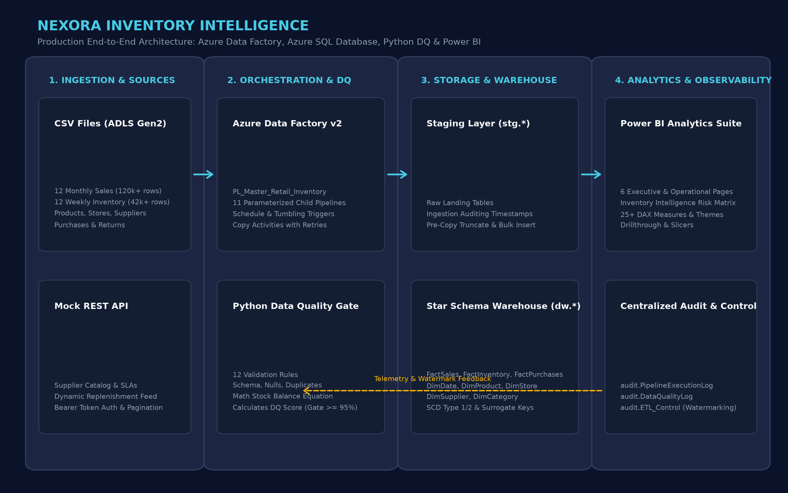
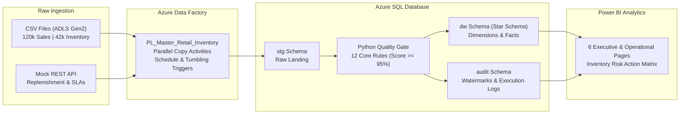
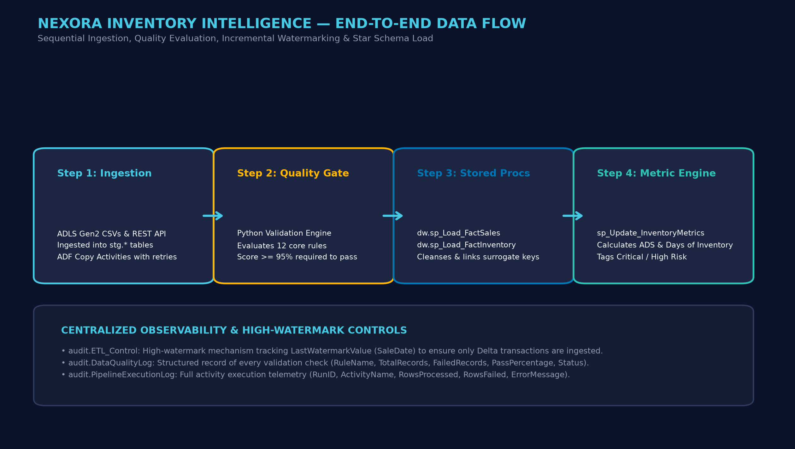
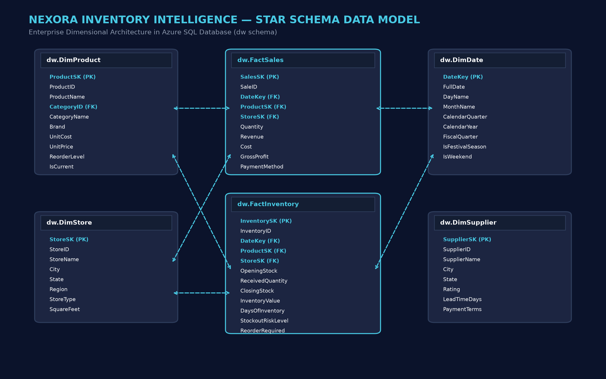
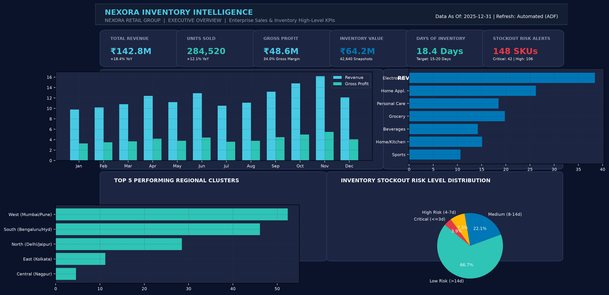
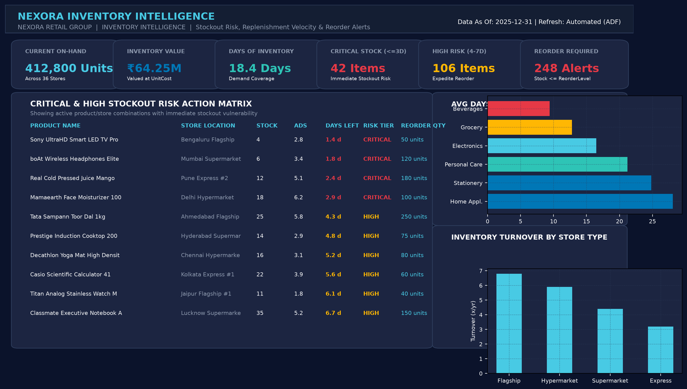
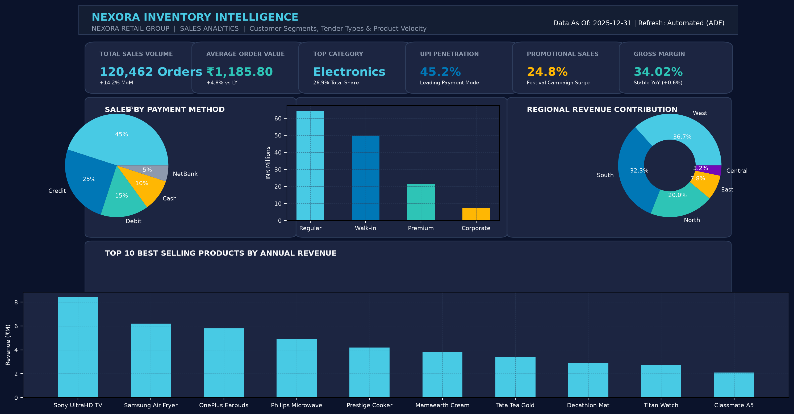
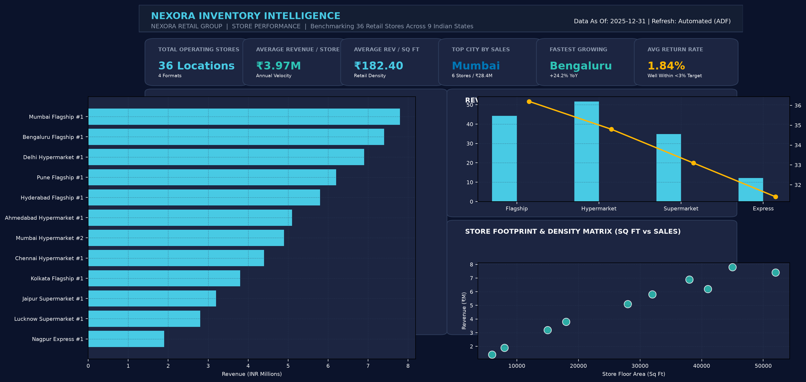
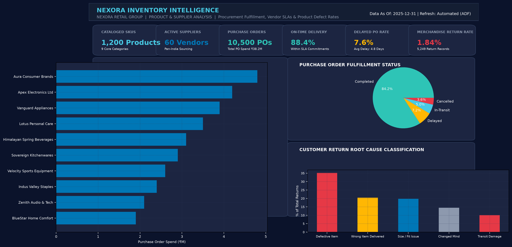
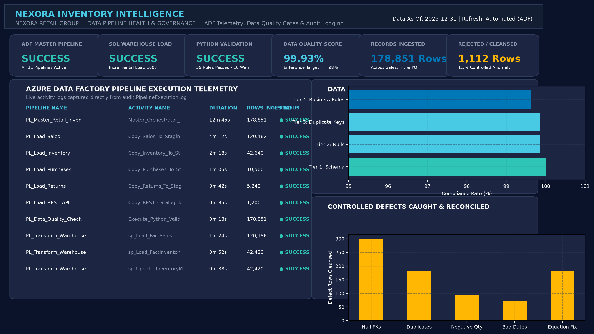

# NEXORA INVENTORY INTELLIGENCE
### An End-to-End Azure Retail Inventory Data Pipeline & Analytics Platform

[](https://azure.microsoft.com/en-us/products/data-factory)
[](https://azure.microsoft.com/en-us/products/azure-sql/database)
[](https://www.python.org/)
[](https://powerbi.microsoft.com/)
[](https://docs.microsoft.com/en-us/sql/t-sql/)
[](#9-python-data-quality-framework)
[](LICENSE)

---

## 1. Project Overview

**Nexora Inventory Intelligence** is an enterprise-grade, production-style retail data engineering and business intelligence platform built for **NEXORA RETAIL GROUP**, a multi-format retail enterprise operating 36 physical stores across 9 Indian states (Maharashtra, Karnataka, Gujarat, Telangana, Delhi, Tamil Nadu, West Bengal, Rajasthan, Uttar Pradesh).

The platform ingests over **178,000+ transactional and inventory records** across 12 calendar months of 2025 from cloud storage and vendor REST APIs, runs automated Python Data Quality gates to protect warehouse integrity, orchestrates incremental loading into an **Azure SQL Database Star Schema**, and powers an executive **Power BI Analytics Suite**.



---

## 2. Business Problem & Objectives

### The Retail Challenge:
Modern multi-store retail organizations face severe financial loss from two opposing inventory failures:
1. **Stockouts & Lost Sales:** High-demand items run out of stock during peak seasonal windows (e.g. summer beverages, Diwali festive groceries), leading to lost revenue and customer attrition.
2. **Excess Working Capital:** Slow-moving merchandise sits in store warehouses for months, tying up liquidity and incurring depreciation.
3. **Data Quality Blindspots:** POS terminals and third-party vendor feeds frequently emit duplicate receipts, missing pricing, negative quantities, and broken inventory conservation math.

### Business Objective:
> *"Help retail management identify inventory problems early, understand product and store performance, and make better replenishment decisions using reliable automated data pipelines."*

---

## 3. Technology Stack

To preserve enterprise focus, zero unnecessary technologies were introduced. The architecture remains strictly centered around:

| Technology | Role in Architecture |
| :--- | :--- |
| **Azure Data Factory (ADF v2)** | Serverless cloud orchestration, copy activities with retries, tumbling window & daily schedule triggers, parameterization, and pipeline logging. |
| **Azure SQL Database** | Relational data warehouse housing Staging (`stg`), Dimensional Star Schema (`dw`), and Observability (`audit`) schemas. |
| **Python 3.x** | Modular 4-tier Data Quality Framework, Mock REST API service, and local end-to-end execution runner. |
| **SQL (T-SQL)** | DDL schemas, constraints, non-clustered indexes, stored procedures with MERGE statements, and analytical views. |
| **Power BI** | Star Schema semantic model, 25+ production DAX measures, custom dark theme, and 6 interactive dashboard pages. |

---

## 4. End-to-End System Architecture

The data pipeline follows a strict, sequential 4-tier lifecycle:





---

## 5. Star Schema Data Model

The enterprise data warehouse is structured around a Kimball Star Schema with surrogate keys and active/inactive role-playing relationships:



### Dimension Tables (`dw`):
- `dw.DimDate`: Calendar year 2024–2026, Indian festival flags (Diwali/festival season), fiscal quarters.
- `dw.DimProduct`: 1,200 SKUs across 9 categories, SCD Type 1 & 2 support, unit cost, MSRP, reorder safety thresholds.
- `dw.DimStore`: 36 stores across 9 states and 12 major cities, square footage, store formats (`Flagship`, `Hypermarket`, `Supermarket`, `Express`).
- `dw.DimSupplier`: 60 vendors, contractual lead times, credit payment terms, and vendor quality ratings.
- `dw.DimCategory`: 9 core retail departments.

### Fact Tables (`dw`):
- `dw.FactSales`: 120,462 transaction lines, revenue, cost, gross profit, tender types, customer segments.
- `dw.FactInventory`: 42,640 weekly snapshots, opening/closing stock, receipts, sales, returns, damages, monetary inventory valuation, Average Daily Sales (ADS), Days of Inventory (DOI), and Stockout Risk Level.
- `dw.FactPurchases`: 10,500 purchase orders tracking procurement fulfillment, status, and delivery variance days.
- `dw.FactReturns`: 5,249 customer return lines linked to sales receipts and reason classifications.

---

## 6. Python Data Quality Framework

Before records are merged from staging into the warehouse, the **Python Data Quality Engine** evaluates the batch against 12 core rules:

```
==========================================================================================
 NEXORA INVENTORY INTELLIGENCE — DATA QUALITY & VALIDATION REPORT
 Run ID: LOCAL_E2E_20260915_121456 | Timestamp: 2026-09-15T06:47:42
==========================================================================================
Table        | Check Type     | Rule Name                          | Pass %   | Status
------------------------------------------------------------------------------------------
categories   | SCHEMA         | Required_Columns_Check             | 100.00% | [PASS]
stores       | SCHEMA         | Required_Columns_Check             | 100.00% | [PASS]
suppliers    | SCHEMA         | Required_Columns_Check             | 100.00% | [PASS]
products     | SCHEMA         | Required_Columns_Check             | 100.00% | [PASS]
products     | NULL           | NotNull_UnitPrice                  |  99.33% | [WARN]
products     | BUSINESS_RULE  | Rule_Standard_Category_Naming      |  99.00% | [WARN]
products     | BUSINESS_RULE  | Rule_Referential_Integrity_Supplie |  99.50% | [WARN]
sales        | SCHEMA         | Required_Columns_Check             | 100.00% | [PASS]
sales        | NULL           | NotNull_StoreID                    |  99.90% | [WARN]
sales        | NULL           | NotNull_ProductID                  |  99.85% | [WARN]
sales        | DUPLICATE      | UniqueKey_SaleID                   |  99.85% | [WARN]
sales        | BUSINESS_RULE  | Rule_Positive_Sales_Quantity       |  99.92% | [WARN]
sales        | BUSINESS_RULE  | Rule_Valid_Calendar_SaleDate       |  99.94% | [WARN]
inventory    | SCHEMA         | Required_Columns_Check             | 100.00% | [PASS]
inventory    | BUSINESS_RULE  | Rule_Non_Negative_ClosingStock     |  99.77% | [WARN]
inventory    | BUSINESS_RULE  | Rule_Inventory_Balance_Equation    |  99.35% | [WARN]
purchases    | BUSINESS_RULE  | Rule_Plausible_Received_Quantity   |  99.67% | [WARN]
returns      | BUSINESS_RULE  | Rule_Positive_Refund_Amount        |  99.43% | [WARN]
==========================================================================================
 Summary: 59 PASS | 16 WARNING | 0 FAIL
 Enterprise Data Quality Score: 99.93% -> Status: APPROVED QUALITY GATE
==========================================================================================
```

### Intentionally Controlled Data Quality Issues (1.5% Defect Rate):
To demonstrate real-world resilience, 1,112 intentional anomalies were injected into source files:
- Missing foreign keys (null `ProductID` / `StoreID` in sales).
- Primary key duplicates (`SaleID`).
- Negative transaction quantities.
- Impossible calendar dates (e.g. `2025-02-30`, `2026-05-15`).
- Broken inventory balance equations ($Closing \ne Opening + Rec - Sold + Ret - Dam$).
- Negative refund amounts.

All detected defects are logged in `audit.DataQualityLog` and reconciled during stored procedure transformation.

---

## 7. Business Logic & Stockout Risk Algorithm

Implemented in `dw.sp_Update_InventoryMetrics`:

1. **Average Daily Sales (ADS):**
   $$\text{ADS} = \frac{\sum_{t=-30}^{0} \text{QuantitySold}}{30}$$
2. **Days of Inventory (DOI):**
   $$\text{DOI} = \frac{\text{ClosingStock}}{\text{ADS}}$$
3. **Stockout Risk Classification:**
   - **`CRITICAL`:** $\text{DOI} \le 3$ days or $\text{ClosingStock} = 0$ (Immediate emergency transfer).
   - **`HIGH`:** $4 \le \text{DOI} \le 7$ days (Expedite procurement PO).
   - **`MEDIUM`:** $8 \le \text{DOI} \le 14$ days (Standard operating stock).
   - **`LOW`:** $\text{DOI} > 14$ days (Sufficient inventory buffer).
4. **Reorder Required Trigger:**
   $$\text{ReorderRequired} = \begin{cases} 1 & \text{if } \text{ClosingStock} \le \text{ReorderLevel} \\ 0 & \text{otherwise} \end{cases}$$

---

## 8. Power BI Analytics Suite

The Power BI solution incorporates our custom **Enterprise Dark Theme (`theme.json`)** with electric cyan and vibrant blue accents:

### Page 1: Executive Overview
High-level KPIs (Revenue, Units, Profit, Margin %, Inventory Value, Stockout Alerts), monthly revenue trend, revenue share by category, regional cluster rankings.


### Page 2: Inventory Intelligence
Stockout Risk Action Matrix with conditional formatting, Days of Inventory by category, and inventory turnover by store format.


### Page 3: Sales Analytics
Sales by tender type (UPI leading at 45.2%), customer segments, regional contribution, and Top 10 revenue-generating products.


### Page 4: Store Performance
Benchmarking 36 stores, store revenue vs square footage density, store format performance, and customer return rates.


### Page 5: Product & Supplier Analysis
Procurement order spend by supplier, on-time delivery rates (88.4%), purchase order status breakdown, and return reasons.


### Page 6: Data Pipeline Health & Governance
Azure Data Factory activity telemetry grid, Data Quality score breakdown across tiers, and cleansed defect counts.


---

## 9. Quick Start: Local Zero-Cloud Execution

Clone and run the complete system locally without an Azure subscription:

```bash
# 1. Install dependencies
pip install pandas numpy matplotlib

# 2. Generate 178,000+ realistic retail records
python python/generate_data.py

# 3. Run Python Data Quality unit tests
python -m unittest tests/python/test_data_quality.py

# 4. Execute end-to-end relational warehouse pipeline
python tests/test_pipeline_local.py

# 5. Render Power BI dashboard screenshots
python power-bi/generate_mockups.py
```

---

## 10. Repository Directory Structure

```
nexora-inventory-intelligence/
├── README.md
├── architecture/
│   ├── architecture-diagram.png
│   ├── data-flow.png
│   ├── star-schema.png
│   └── generate_diagrams.py
├── data/
│   ├── categories.csv
│   ├── products.csv
│   ├── stores.csv
│   ├── suppliers.csv
│   ├── sales/ (12 monthly CSVs, 120k+ rows)
│   ├── inventory/ (12 monthly CSVs, 42k+ rows)
│   ├── purchases/ (purchase_orders.csv)
│   └── returns/ (returns.csv)
├── python/
│   ├── config.py
│   ├── mock_api.py
│   ├── generate_data.py
│   ├── schema_validator.py
│   ├── null_validator.py
│   ├── duplicate_validator.py
│   ├── business_rule_validator.py
│   ├── data_quality.py
│   ├── pipeline_validator.py
│   └── main.py
├── sql/
│   ├── database/00_init_database.sql
│   ├── staging/01_staging_tables.sql
│   ├── warehouse/02_dim_tables.sql
│   ├── warehouse/03_fact_tables.sql
│   ├── audit/04_audit_tables.sql
│   ├── stored_procedures/ (10 stored procedures)
│   ├── views/ (3 analytical views)
│   └── indexes/05_warehouse_indexes.sql
├── azure-data-factory/
│   ├── linked-services/ (3 linked services)
│   ├── datasets/ (5 datasets)
│   ├── pipelines/ (11 pipelines)
│   ├── triggers/ (2 triggers)
│   └── parameters/global-parameters.json
├── power-bi/
│   ├── data-model.md
│   ├── dax-measures.md
│   ├── theme.json
│   ├── generate_mockups.py
│   └── screenshots/ (6 dashboard screenshots)
├── tests/
│   ├── python/test_data_quality.py
│   ├── sql/test_warehouse_integrity.sql
│   └── test_pipeline_local.py
└── documentation/
    ├── architecture.md
    ├── data-dictionary.md
    ├── pipeline-documentation.md
    ├── data-quality-rules.md
    ├── deployment-guide.md
    └── interview-guide.md
```

---

## 11. Key Engineering Takeaways & Interview Readiness

- **Why Not Databricks/Spark?** Right-sized architecture: ~180k rows/day does not justify 4-minute cluster spin-up latencies or thousands in monthly compute fees. ADF + Azure SQL stored procedures execute in under 3 minutes for pennies per day.
- **Why Staging?** Decouples file transport from warehouse dimensional loading, isolates corrupted vendor feeds, and hosts automated quality gates.
- **Why Star Schema?** Enables role-playing calendar dates, maximizes Power BI VertiPaq column compression, and eliminates denormalization anomalies.
- **Why Python Validation?** Quantifies quality with a numeric score (0–100%) and multi-tier alerting rather than binary SQL constraint crashes.

For full technical Q&A, review [documentation/interview-guide.md](documentation/interview-guide.md).
