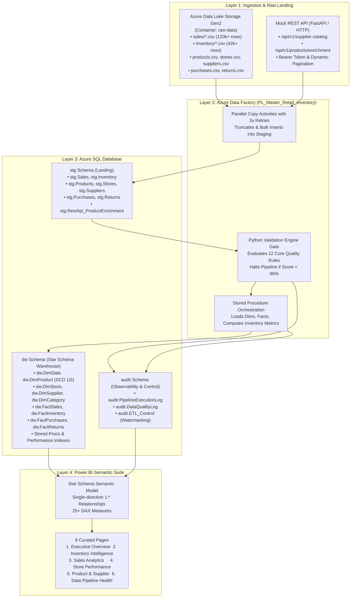

# CLARIVENS INVENTORY INTELLIGENCE — SYSTEM ARCHITECTURE SPECIFICATION
**Organization:** CLARIVENS RETAIL GROUP  
**Platform:** Azure Retail Inventory Data Pipeline & Analytics Platform  
**Version:** 1.0.0 (Production Architecture)

---

## 1. Executive Summary

**Clarivens Inventory Intelligence** is an enterprise data engineering and analytics solution designed to ingest, validate, curate, and visualize retail inventory, purchasing, sales velocity, and stockout risk across 36 multi-format stores in India.

The platform processes multi-source data feeds from raw cloud storage (ADLS Gen2 / Azure Blob) and external vendor REST APIs, runs automated Python Data Quality gates to protect warehouse integrity, loads curated star-schema dimensional models via incremental watermarking, and powers an executive Power BI reporting suite.

---

## 2. Core Architectural Pillars

### 2.1 Technology Stack Boundaries
To maintain enterprise focus, zero unnecessary infrastructure is introduced. The primary components are strictly:

1. **Azure Data Factory v2 (ADF):** Ingestion orchestration, copy activities, triggers, retries, and dependency workflows.
2. **Azure SQL Database (General Purpose / Business Critical):** Enterprise staging (`stg`), dimensional warehouse (`dw`), and observability (`audit`) schemas.
3. **Python 3.x:** Modular Data Quality validation engine, mock REST API service, and local verification runner.
4. **SQL (T-SQL):** DDL, constraints, non-clustered indexes, stored procedures, MERGE statements, and analytical views.
5. **Power BI:** Star schema semantic model, DAX calculation engine, dark enterprise visual theme, and 6 interactive dashboard pages.

---

## 3. Layered Data Architecture

---

## 4. Architectural Resilience & Failure Mitigation

### 4.1 Staging Isolation
Raw data files are never written directly to business-critical dimensional tables. Ingesting into `stg.*` decouples the file parsing and network ingestion step from the data modeling step, enabling:
- Fast bulk load into unconstrained staging tables.
- Automated validation by Python before records touch production dimensions.
- Graceful error containment: defective batches can be reviewed in staging without corrupting historical analytics.

### 4.2 Incremental Watermarking Strategy
Full table reloads on 120,000+ transaction rows cause unnecessary DTU/vCore consumption and blocking locks. Clarivens implements high-watermark incremental ingestion via `audit.ETL_Control`:
1. `PL_Load_Sales` performs a lookup on `audit.ETL_Control` to retrieve `LastWatermarkValue` (e.g. `'2025-10-31'`).
2. Only records matching `SaleDate > LastWatermarkValue` are staged and merged into `dw.FactSales`.
3. Following successful execution, `audit.ETL_Control` is updated atomically to `MAX(SaleDate)`.

### 4.3 Automated Quality Gate
The Python Data Quality engine validates 12 rules across schema, nulls, duplicates, and domain equations. If the overall Data Quality Score drops below 95.0%, the pipeline execution halts immediately, preventing bad data from entering `dw.FactSales` or `dw.FactInventory`.

---

## 5. Security & Secret Governance

1. **Credential Hygiene:** No plaintext passwords, database connection strings, or API tokens exist in source code or ADF JSON templates.
2. **Managed Identity:** In cloud deployment, ADF communicates with Azure SQL Database and Azure Data Lake Storage using **System-Assigned Managed Identities (SAMI)**.
3. **Azure Key Vault Integration:** REST API bearer tokens and function master keys are maintained in Azure Key Vault and dynamically retrieved using ADF Web activities with secure string parameters.
