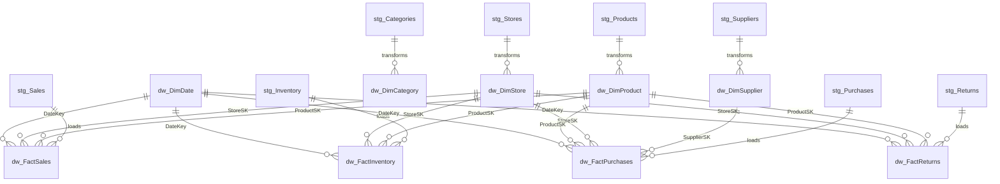

# NEXORA INVENTORY INTELLIGENCE — DATA DICTIONARY
**Organization:** NEXORA RETAIL GROUP  
**Platform:** Azure Retail Inventory Data Pipeline & Analytics Platform  
**Version:** 1.0.0 (Production Architecture)

---

## 1. Overview & Data Architecture

This document details the data schemas, field-level definitions, referential constraints, and intended business usage across all staging (`stg`), enterprise warehouse (`dw`), and audit (`audit`) layers of the **Nexora Inventory Intelligence** platform.

---

## 2. Dimension Tables (`dw`)

### 2.1 `dw.DimDate`
The central enterprise calendar dimension containing 2024–2026 dates, holiday indicators, Indian festival seasons, and retail fiscal periods.

| Column Name | Data Type | Nullable | Primary/Foreign Key | Description | Example Values |
| :--- | :--- | :--- | :--- | :--- | :--- |
| `DateKey` | `INT` | No | **PK** | Integer surrogate key in `YYYYMMDD` format | `20251015`, `20251101` |
| `FullDate` | `DATE` | No | | Standard SQL calendar date | `2025-10-15` |
| `DayNumberOfWeek` | `TINYINT` | No | | 1 (Sunday) through 7 (Saturday) | `4` |
| `DayName` | `VARCHAR(10)` | No | | Full name of the weekday | `'Wednesday'` |
| `DayNumberOfMonth` | `TINYINT` | No | | Day of current month (1–31) | `15` |
| `DayNumberOfYear` | `SMALLINT` | No | | Day of calendar year (1–366) | `288` |
| `WeekNumberOfYear` | `TINYINT` | No | | Calendar week number (1–53) | `42` |
| `MonthName` | `VARCHAR(10)` | No | | Full name of the month | `'October'` |
| `MonthNumberOfYear`| `TINYINT` | No | | Calendar month number (1–12) | `10` |
| `CalendarQuarter` | `TINYINT` | No | | Quarter (1–4) | `4` |
| `CalendarYear` | `SMALLINT` | No | | Four-digit calendar year | `2025` |
| `FiscalYear` | `SMALLINT` | No | | Indian retail fiscal year (Apr–Mar) | `2025` |
| `FiscalQuarter` | `TINYINT` | No | | Fiscal Quarter (Q1=Apr-Jun, Q4=Jan-Mar) | `3` |
| `IsWeekend` | `BIT` | No | | Flag: 1 for Saturday/Sunday, else 0 | `0` |
| `IsFestivalSeason` | `BIT` | No | | Flag: 1 for Indian festive surge (Oct–Nov) | `1` |

### 2.2 `dw.DimProduct`
Master catalog of retail SKUs, categories, brands, baseline costs, pricing, and replenishment triggers.

| Column Name | Data Type | Nullable | Primary/Foreign Key | Description | Example Values |
| :--- | :--- | :--- | :--- | :--- | :--- |
| `ProductSK` | `INT IDENTITY`| No | **PK** | System-generated surrogate key | `1042` |
| `ProductID` | `VARCHAR(20)` | No | Natural Key | Operational business product identifier | `'PRD00142'` |
| `ProductName` | `VARCHAR(150)`| No | | Full commercial product name | `'Sony UltraHD Smart LED TV Pro 420'` |
| `CategoryID` | `VARCHAR(20)` | No | | Foreign key to Category dimension | `'CAT001'` |
| `CategoryName` | `VARCHAR(50)` | No | | Standardized category name | `'Electronics'` |
| `Department` | `VARCHAR(50)` | No | | High-level organizational department | `'Technology'` |
| `SupplierID` | `VARCHAR(20)` | No | | Preferred supplier business key | `'SUP003'` |
| `Brand` | `VARCHAR(50)` | No | | Brand name | `'Sony'` |
| `UnitCost` | `DECIMAL(18,2)`| No | | Current purchase cost in INR | `14250.00` |
| `UnitPrice` | `DECIMAL(18,2)`| No | | Standard selling price (MSRP) in INR | `19499.00` |
| `ReorderLevel` | `INT` | No | | Minimum safety stock before PO trigger | `20` |
| `ReorderQuantity`| `INT` | No | | Standard batch replenishment quantity | `50` |
| `LaunchDate` | `DATE` | No | | Product market launch date | `2023-08-12` |
| `IsActive` | `BIT` | No | | Active lifecycle status | `1` |
| `EffectiveDate` | `DATETIME2` | No | | SCD Type 2 row effective start date | `2025-01-01 00:00:00` |
| `ExpiryDate` | `DATETIME2` | Yes | | SCD Type 2 row effective end date | `9999-12-31 23:59:59` |
| `IsCurrent` | `BIT` | No | | 1 if current active record, else 0 | `1` |

### 2.3 `dw.DimStore`
Physical store footprints across 9 Indian states, regional classifications, store formats, and store leadership.

| Column Name | Data Type | Nullable | Primary/Foreign Key | Description | Example Values |
| :--- | :--- | :--- | :--- | :--- | :--- |
| `StoreSK` | `INT IDENTITY`| No | **PK** | System-generated surrogate key | `14` |
| `StoreID` | `VARCHAR(20)` | No | Natural Key | Operational retail store identifier | `'STR014'` |
| `StoreName` | `VARCHAR(100)`| No | | Full branch name | `'Nexora Bengaluru Flagship #2'` |
| `City` | `VARCHAR(50)` | No | | City location | `'Bengaluru'` |
| `State` | `VARCHAR(50)` | No | | Indian state | `'Karnataka'` |
| `Region` | `VARCHAR(20)` | No | | Sales territory (`West`, `South`, `North`, `East`) | `'South'` |
| `StoreType` | `VARCHAR(30)` | No | | Retail store format | `'Flagship'`, `'Hypermarket'`, `'Supermarket'`, `'Express'` |
| `SquareFeet` | `INT` | No | | Usable retail floor area | `48500` |
| `Manager` | `VARCHAR(100)`| No | | Store general manager name | `'Rahul Deshmukh'` |
| `OpeningDate` | `DATE` | No | | Store grand opening date | `2020-04-18` |
| `IsActive` | `BIT` | No | | Operating operational status | `1` |

### 2.4 `dw.DimSupplier`
Vendors supplying merchandise, lead time commitments, contractual terms, and quality ratings.

| Column Name | Data Type | Nullable | Primary/Foreign Key | Description | Example Values |
| :--- | :--- | :--- | :--- | :--- | :--- |
| `SupplierSK` | `INT IDENTITY`| No | **PK** | Surrogate primary key | `22` |
| `SupplierID` | `VARCHAR(20)` | No | Natural Key | Business supplier code | `'SUP022'` |
| `SupplierName` | `VARCHAR(100)`| No | | Commercial corporate entity name | `'Orient Digital Innovations'` |
| `ContactName` | `VARCHAR(100)`| No | | Primary account representative | `'Contact for Orient Digital'` |
| `Email` | `VARCHAR(100)`| No | | Procurement contact email | `'procurement@orientdigital.in'` |
| `Phone` | `VARCHAR(30)` | No | | Business phone number | `'+91 84512 67890'` |
| `City` | `VARCHAR(50)` | No | | Vendor dispatch center city | `'Bengaluru'` |
| `State` | `VARCHAR(50)` | No | | Vendor registered state | `'Karnataka'` |
| `Rating` | `DECIMAL(3,2)` | No | | Vendor reliability rating (1.0 to 5.0) | `4.65` |
| `PaymentTerms` | `VARCHAR(30)` | No | | Commercial invoice payment terms | `'Net 30'`, `'Net 45'`, `'2/10 Net 30'` |
| `LeadTimeDays` | `INT` | No | | Average replenishment lead time | `7` |
| `IsActive` | `BIT` | No | | Active vendor contract status | `1` |

### 2.5 `dw.DimCategory`
Departmental hierarchy grouping retail product assortments.

| Column Name | Data Type | Nullable | Primary/Foreign Key | Description | Example Values |
| :--- | :--- | :--- | :--- | :--- | :--- |
| `CategorySK` | `INT IDENTITY`| No | **PK** | Surrogate primary key | `1` |
| `CategoryID` | `VARCHAR(20)` | No | Natural Key | Operational category code | `'CAT001'` |
| `CategoryName` | `VARCHAR(50)` | No | | Standard category title | `'Electronics'` |
| `Department` | `VARCHAR(50)` | No | | Broad retail department | `'Technology'` |

---

## 3. Fact Tables (`dw`)

### 3.1 `dw.FactSales`
Transactional POS sales line-items recorded across all 36 retail branches.

| Column Name | Data Type | Nullable | Primary/Foreign Key | Description | Example Values |
| :--- | :--- | :--- | :--- | :--- | :--- |
| `SalesSK` | `BIGINT IDENTITY`| No | **PK** | Transaction fact surrogate key | `501239` |
| `SaleID` | `VARCHAR(30)` | No | Natural Key | POS terminal receipt transaction ID | `'SAL20250045120'` |
| `DateKey` | `INT` | No | **FK -> DimDate** | Date key of sale in `YYYYMMDD` | `20250614` |
| `ProductSK` | `INT` | No | **FK -> DimProduct** | Product surrogate key | `1042` |
| `StoreSK` | `INT` | No | **FK -> DimStore** | Store surrogate key | `14` |
| `Quantity` | `INT` | No | | Number of units sold ($\ge 1$) | `2` |
| `UnitPrice` | `DECIMAL(18,2)`| No | | Unit selling price at sale | `19499.00` |
| `Discount` | `DECIMAL(5,2)` | No | | Promotional discount fraction ($0.00 - 0.50$) | `0.10` |
| `Revenue` | `DECIMAL(18,2)`| No | | Net line-item revenue ($Qty \times Price \times (1-Disc)$) | `35098.20` |
| `Cost` | `DECIMAL(18,2)`| No | | Line-item COGS ($Qty \times UnitCost$) | `28500.00` |
| `GrossProfit` | `DECIMAL(18,2)`| No | | Gross profit ($Revenue - Cost$) | `6598.20` |
| `PaymentMethod` | `VARCHAR(30)` | No | | Customer payment method | `'UPI'`, `'Credit Card'`, `'Cash'` |
| `CustomerSegment`| `VARCHAR(30)` | No | | Customer tier | `'Regular'`, `'Premium'`, `'Corporate'` |
| `ETL_LoadTime` | `DATETIME2` | No | | Warehouse ingestion timestamp | `2025-12-31 23:45:10` |

### 3.2 `dw.FactInventory`
Weekly inventory balance snapshots capturing store-level stock movements and health classifications.

| Column Name | Data Type | Nullable | Primary/Foreign Key | Description | Example Values |
| :--- | :--- | :--- | :--- | :--- | :--- |
| `InventorySK` | `BIGINT IDENTITY`| No | **PK** | Inventory snapshot surrogate key | `24510` |
| `InventoryID` | `VARCHAR(30)` | No | Natural Key | Inventory snapshot transaction code | `'INV00024510'` |
| `DateKey` | `INT` | No | **FK -> DimDate** | Snapshot date key in `YYYYMMDD` | `20250720` |
| `ProductSK` | `INT` | No | **FK -> DimProduct** | Product surrogate key | `89` |
| `StoreSK` | `INT` | No | **FK -> DimStore** | Store surrogate key | `4` |
| `OpeningStock` | `INT` | No | | Available units at start of snapshot cycle | `120` |
| `ReceivedQuantity`| `INT` | No | | Replenishment received from POs | `50` |
| `SoldQuantity` | `INT` | No | | Customer units sold during cycle | `65` |
| `ReturnQuantity` | `INT` | No | | Customer returns accepted | `3` |
| `DamagedQuantity`| `INT` | No | | Shrinkage / damaged units written off | `1` |
| `ClosingStock` | `INT` | No | | Ending inventory: $Open + Rec - Sold + Ret - Dam$ | `107` |
| `InventoryValue` | `DECIMAL(18,2)`| No | | Monetary valuation ($ClosingStock \times UnitCost$) | `152475.00` |
| `AverageDailySales`| `DECIMAL(10,2)`| No | | Moving 30-day average daily sales velocity | `9.28` |
| `DaysOfInventory`| `DECIMAL(10,2)`| No | | Estimated stock coverage ($\frac{ClosingStock}{ADS}$) | `11.53` |
| `StockoutRiskLevel`| `VARCHAR(15)` | No | | Risk category: `CRITICAL`, `HIGH`, `MEDIUM`, `LOW` | `'MEDIUM'` |
| `ReorderRequired`| `BIT` | No | | 1 if $ClosingStock \le ReorderLevel$, else 0 | `0` |

### 3.3 `dw.FactPurchases`
Procurement purchase orders dispatched to suppliers, tracking delivery timelines and fulfillment completeness.

| Column Name | Data Type | Nullable | Primary/Foreign Key | Description | Example Values |
| :--- | :--- | :--- | :--- | :--- | :--- |
| `PurchaseSK` | `BIGINT IDENTITY`| No | **PK** | Purchase fact surrogate key | `8402` |
| `PurchaseOrderID`| `VARCHAR(30)` | No | Natural Key | PO tracking number | `'PO2025008402'` |
| `OrderDateKey` | `INT` | No | **FK -> DimDate** | Date PO placed | `20250410` |
| `ExpectedDeliveryDateKey`| `INT`| No | **FK -> DimDate** | Contractual arrival target | `20250417` |
| `ActualDeliveryDateKey`| `INT` | Yes | **FK -> DimDate** | Actual dock delivery date | `20250419` |
| `SupplierSK` | `INT` | No | **FK -> DimSupplier** | Supplier surrogate key | `8` |
| `StoreSK` | `INT` | No | **FK -> DimStore** | Destination store surrogate key | `2` |
| `ProductSK` | `INT` | No | **FK -> DimProduct** | Product surrogate key | `412` |
| `OrderedQuantity`| `INT` | No | | Units requisitioned | `150` |
| `ReceivedQuantity`| `INT` | No | | Units verified at destination warehouse | `150` |
| `UnitCost` | `DECIMAL(18,2)`| No | | Contract cost per unit | `420.00` |
| `TotalCost` | `DECIMAL(18,2)`| No | | Total order expense ($OrderedQty \times UnitCost$) | `63000.00` |
| `Status` | `VARCHAR(20)` | No | | Status: `Completed`, `Delayed`, `In-Transit`, `Cancelled` | `'Delayed'` |
| `DeliveryVarianceDays`| `INT` | Yes | | $Actual - Expected$ delivery days | `2` |

### 3.4 `dw.FactReturns`
Product merchandise returns processed at POS service counters.

| Column Name | Data Type | Nullable | Primary/Foreign Key | Description | Example Values |
| :--- | :--- | :--- | :--- | :--- | :--- |
| `ReturnSK` | `BIGINT IDENTITY`| No | **PK** | Return surrogate key | `3420` |
| `ReturnID` | `VARCHAR(30)` | No | Natural Key | RMA / Return transaction ID | `'RET2025003420'` |
| `DateKey` | `INT` | No | **FK -> DimDate** | Return date in `YYYYMMDD` | `20250812` |
| `ProductSK` | `INT` | No | **FK -> DimProduct** | Product surrogate key | `301` |
| `StoreSK` | `INT` | No | **FK -> DimStore** | Store surrogate key | `11` |
| `SaleID` | `VARCHAR(30)` | No | | Original purchase receipt ID | `'SAL20250021942'` |
| `Quantity` | `INT` | No | | Units returned | `1` |
| `RefundAmount` | `DECIMAL(18,2)`| No | | Total amount refunded to customer | `1850.00` |
| `ReturnReason` | `VARCHAR(50)` | No | | Classification reason | `'Defective Item'` |

---

## 4. Audit & ETL Control Schema (`audit`)

### 4.1 `audit.PipelineExecutionLog`
Centralized observability table capturing pipeline run telemetry across ADF, Python, and SQL procedures.

| Column Name | Data Type | Nullable | Description |
| :--- | :--- | :--- | :--- |
| `LogID` | `BIGINT IDENTITY` | No | Auto-incrementing primary key |
| `RunID` | `VARCHAR(64)` | No | ADF pipeline run ID or batch run GUID |
| `PipelineName` | `VARCHAR(100)` | No | Name of executed pipeline / activity |
| `ActivityName` | `VARCHAR(100)` | No | Specific task (e.g. `Copy_Sales_CSV_to_Staging`) |
| `StartTime` | `DATETIME2` | No | Execution begin timestamp |
| `EndTime` | `DATETIME2` | Yes | Execution completion timestamp |
| `Status` | `VARCHAR(20)` | No | `SUCCESS`, `FAILED`, `WARNING`, `RUNNING` |
| `RowsProcessed` | `BIGINT` | Yes | Total records ingested/transformed |
| `RowsFailed` | `BIGINT` | Yes | Count of records rejected by DQ rules |
| `ErrorMessage` | `NVARCHAR(MAX)` | Yes | Exception message or stack trace upon failure |

### 4.2 `audit.DataQualityLog`
Granular validation log generated by the Python Data Quality Engine detailing individual test results and compliance scores.

| Column Name | Data Type | Nullable | Description |
| :--- | :--- | :--- | :--- |
| `QualityCheckID` | `BIGINT IDENTITY` | No | Auto-incrementing primary key |
| `RunID` | `VARCHAR(64)` | No | Batch execution run identifier |
| `TableName` | `VARCHAR(50)` | No | Target table validated (e.g. `sales`, `inventory`) |
| `CheckType` | `VARCHAR(50)` | No | `SCHEMA`, `NULL`, `DUPLICATE`, `BUSINESS_RULE` |
| `RuleName` | `VARCHAR(100)` | No | Name of rule (e.g. `Check_Positive_Quantity`) |
| `TotalRecords` | `BIGINT` | No | Denominator: total rows evaluated |
| `FailedRecords` | `BIGINT` | No | Numerator: defective rows caught |
| `PassPercentage` | `DECIMAL(5,2)` | No | Compliance rate: $\frac{Total - Failed}{Total} \times 100$ |
| `Status` | `VARCHAR(20)` | No | `PASS` ($\ge 98\%$), `WARNING` ($95-98\%$), `FAIL` ($<95\%$) |
| `ExecutionTime` | `DATETIME2` | No | Timestamp when validation was executed |
| `ErrorMessage` | `NVARCHAR(MAX)` | Yes | Detailed failure report with offending sample keys |

### 4.3 `audit.ETL_Control`
High-watermark tracking table enabling incremental ingestion of Delta sales, inventory, and purchases.

| Column Name | Data Type | Nullable | Description |
| :--- | :--- | :--- | :--- |
| `PipelineName` | `VARCHAR(100)` | No | Unique pipeline identifier (e.g. `PL_Load_Sales`) |
| `TableName` | `VARCHAR(100)` | No | Target warehouse table (e.g. `dw.FactSales`) |
| `WatermarkColumn` | `VARCHAR(50)` | No | Incremental tracking column (e.g. `SaleDate`) |
| `LastWatermarkValue` | `VARCHAR(100)` | No | High-watermark boundary (e.g. `'2025-11-30'`) |
| `LastSuccessfulLoad` | `DATETIME2` | No | Timestamp of the last successful run |
| `LastRunID` | `VARCHAR(64)` | No | RunID of the last successful load |
| `LastRunStatus` | `VARCHAR(20)` | No | Final state: `SUCCESS` or `FAILED` |
| `UpdatedAt` | `DATETIME2` | No | Modification timestamp |

---

## 5. Controlled Data Quality Defects Summary

To enable practical validation testing, the following intentional defects are maintained in the raw data files at a rate of 1.5% to 2.5%:

| Target File / Table | Injected Defect Category | Frequency | Expected Python DQ Rule Triggered |
| :--- | :--- | :--- | :--- |
| `products.csv` | Inconsistent category casing (`"electronic"`, `"ELECTR"`) | 12 rows | `Rule_Category_Standardization` |
| `products.csv` | Null UnitPrice | 8 rows | `Rule_Null_Price` |
| `products.csv` | Invalid SupplierID (`SUP999`) | 6 rows | `Rule_Referential_Integrity_Supplier` |
| `sales/*.csv` | Missing ProductID (`NULL`) | 180 rows | `Rule_Null_ProductID` |
| `sales/*.csv` | Missing StoreID (`NULL`) | 120 rows | `Rule_Null_StoreID` |
| `sales/*.csv` | Negative Quantity | 96 rows | `Rule_Positive_Quantity` |
| `sales/*.csv` | Invalid / Future calendar date (`2026-05-15`, `2025-02-30`) | 72 rows | `Rule_Valid_Calendar_Date` |
| `sales/*.csv` | Duplicate Transaction IDs (`SaleID`) | 180 rows | `Rule_Unique_SaleID` |
| `inventory/*.csv` | Broken inventory math ($Close \ne Open + Rec - Sold + Ret - Dam$) | 180 rows | `Rule_Inventory_Balance_Equation` |
| `inventory/*.csv` | Negative Closing Stock | 96 rows | `Rule_Non_Negative_Stock` |
| `inventory/*.csv` | Impossible negative inventory valuation ($< 0$) | 72 rows | `Rule_Non_Negative_Inventory_Value` |
| `purchases/purchase_orders.csv` | Received quantity $> 5\times$ ordered quantity | 35 rows | `Rule_Plausible_Received_Quantity` |
| `purchases/purchase_orders.csv` | Actual delivery date prior to order date | 25 rows | `Rule_Chronological_Delivery_Dates` |
| `returns/returns.csv` | Negative refund amount | 30 rows | `Rule_Positive_Refund_Amount` |
