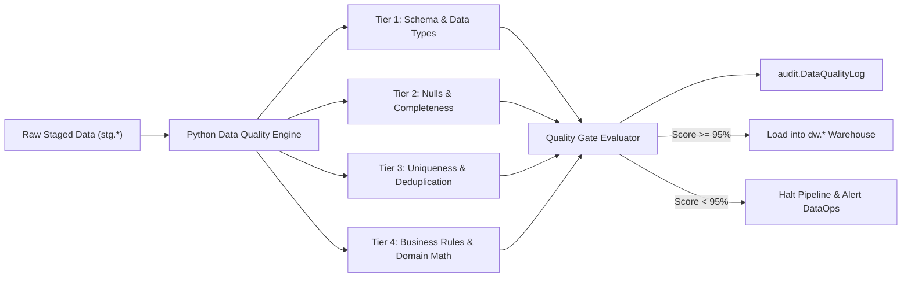

# CLARIVENS INVENTORY INTELLIGENCE — DATA QUALITY RULES SPECIFICATION
**Organization:** CLARIVENS RETAIL GROUP  
**Platform:** Python Data Quality & Validation Framework  
**Version:** 1.0.0 (Production Architecture)

---

## 1. Quality Architecture & Framework Philosophy

Data quality is not treated as an afterthought or a one-off SQL script. In the **Clarivens Inventory Intelligence** platform, the Python validation engine functions as an automated **Quality Gate** sitting between raw data lake staging (`stg`) and the enterprise Star Schema (`dw`).



---

## 2. Thresholds & Status Classifications

Every validation check computes a record-level compliance rate:

$$\text{Pass Percentage} = \left(\frac{\text{Total Records} - \text{Failed Records}}{\text{Total Records}}\right) \times 100$$

| Compliance Band | Status | Pipeline Action | Description |
| :--- | :--- | :--- | :--- |
| **$\ge 98.0\%$** | `PASS` | Proceed to Warehouse | Clean data; within production quality tolerance. |
| **$95.0\% - 97.9\%$** | `WARNING` | Proceed with Cleansing | Minor defects detected; cleansed by transformation SQL; alerts logged to audit tables. |
| **$< 95.0\%$** | `FAIL` | **HALT PIPELINE** | Critical quality defect; prevents warehouse corruption; triggers immediate on-call incident. |

---

## 3. Catalog of the 12 Core Data Quality Rules

### 3.1 Tier 1: Schema & Structural Integrity

#### Rule 1: `Required_Columns_Check`
- **Target Tables:** All tables (`products`, `stores`, `suppliers`, `categories`, `sales`, `inventory`, `purchases`, `returns`).
- **Severity:** `CRITICAL` (Status: `FAIL` if triggered).
- **Formula / Logic:**
  $$\text{ActualColumns} \supseteq \text{ExpectedColumns}$$
  If any expected column is missing, the entire file fails validation.

#### Rule 2: `Data_Type_Coercion_Check`
- **Target Tables:** All numerical, date, and decimal fields.
- **Severity:** `HIGH`
- **Logic:** Validates that numeric columns (`Quantity`, `UnitPrice`, `Cost`, `OpeningStock`, `ClosingStock`) can be parsed as valid numeric types without throwing parser exceptions.

---

### 3.2 Tier 2: Completeness & Null Analysis

#### Rule 3: `NotNull_Mandatory_Keys`
- **Target Columns:** `SaleID`, `InventoryID`, `PurchaseOrderID`, `ReturnID`, `StoreID`, `ProductID`, `SupplierID`.
- **Severity:** `CRITICAL`
- **Formula:**
  $$\text{Condition: } \text{Column IS NOT NULL} \land \text{TRIM}(\text{Column}) \notin (\text{''}, \text{'nan'}, \text{'NULL'})$$
  Rejects records where primary foreign or operational natural keys are unpopulated.

#### Rule 4: `NotNull_Commercial_Values`
- **Target Columns:** `UnitPrice`, `UnitCost`, `Revenue`, `RefundAmount`.
- **Severity:** `HIGH`
- **Logic:** Identifies active SKUs or transactions lacking valid commercial pricing or costing metadata.

---

### 3.3 Tier 3: Uniqueness & Grain Integrity

#### Rule 5: `UniqueKey_Deduplication`
- **Target Keys:**
  - `sales`: `SaleID`
  - `inventory`: `InventoryID` (or composite `StoreID` + `ProductID` + `SnapshotDate`)
  - `purchases`: `PurchaseOrderID`
  - `returns`: `ReturnID`
- **Severity:** `HIGH`
- **Formula:**
  $$\text{Duplicate Count} = \sum (\text{COUNT}(*) - 1) \text{ grouped by Primary Key}$$
  Deduplication rank window functions discard duplicate transaction copies during staging load.

---

### 3.4 Tier 4: Business Rules & Domain Validation

#### Rule 6: `Rule_Positive_Sales_Quantity`
- **Target:** `stg.Sales.Quantity`
- **Severity:** `HIGH`
- **Formula:**
  $$\text{Quantity} > 0$$
  Negative quantities represent customer return transactions and must be recorded strictly in `returns`, not `sales`.

#### Rule 7: `Rule_Revenue_Equation_Integrity`
- **Target:** `stg.Sales.Revenue`
- **Severity:** `HIGH`
- **Formula:**
  $$\left|\text{Revenue} - \left(\text{Quantity} \times \text{UnitPrice} \times (1 - \text{Discount})\right)\right| \le 1.50$$
  Verifies that financial transaction amounts mathematically tie back to volume and promotional discounts.

#### Rule 8: `Rule_Valid_Calendar_SaleDate`
- **Target:** `stg.Sales.SaleDate`
- **Severity:** `HIGH`
- **Formula:**
  $$\text{TRY\_CAST}(\text{SaleDate AS DATE}) \le \text{'2025-12-31'}$$
  Rejects transactions with impossible calendar dates (e.g. `2025-02-30`) or dates occurring in future calendar periods.

#### Rule 9: `Rule_Referential_Integrity_ProductID_StoreID_SupplierID`
- **Target:** Foreign keys across `sales`, `inventory`, `purchases`, `products`.
- **Severity:** `HIGH`
- **Formula:**
  $$\text{ForeignKeyValue} \in \text{MasterDimensionKeys}$$
  Catches orphan records where transactions reference deleted or non-existent retail stores, products, or suppliers.

#### Rule 10: `Rule_Inventory_Balance_Equation`
- **Target:** `stg.Inventory`
- **Severity:** `HIGH`
- **Formula:**
  $$\text{ClosingStock} = \text{OpeningStock} + \text{ReceivedQuantity} - \text{SoldQuantity} + \text{ReturnQuantity} - \text{DamagedQuantity}$$
  Validates physical stock balance conservation across weekly snapshots. Any mismatch is flagged as broken inventory tracking.

#### Rule 11: `Rule_Non_Negative_ClosingStock_and_Value`
- **Target:** `stg.Inventory.ClosingStock`, `stg.Inventory.InventoryValue`
- **Severity:** `CRITICAL`
- **Formula:**
  $$\text{ClosingStock} \ge 0 \quad \land \quad \text{InventoryValue} \ge 0.00$$
  Prevents impossible negative physical on-hand inventory counts or negative monetary stock values.

#### Rule 12: `Rule_Chronological_Procurement_Dates`
- **Target:** `stg.Purchases.OrderDate`, `stg.Purchases.ActualDeliveryDate`
- **Severity:** `HIGH`
- **Formula:**
  $$\text{ActualDeliveryDate} \ge \text{OrderDate}$$
  Ensures dock delivery timestamps occur chronologically on or after the purchase order requisition date.

---

## 4. Audit Log Schema Integration (`audit.DataQualityLog`)

Every validation run automatically persists its evaluation findings into `audit.DataQualityLog`:

```sql
SELECT 
    RunID,
    TableName,
    CheckType,
    RuleName,
    TotalRecords,
    FailedRecords,
    PassPercentage,
    Status,
    ErrorMessage,
    ExecutionTime
FROM audit.DataQualityLog
ORDER BY ExecutionTime DESC;
```

This log directly powers **Page 6 (Data Pipeline Health)** in the Power BI dashboard, providing executives and analytics engineers with transparency into data quality trends.
