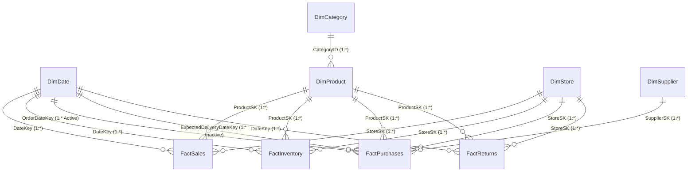

# CLARIVENS INVENTORY INTELLIGENCE — POWER BI SEMANTIC DATA MODEL
**Organization:** CLARIVENS RETAIL GROUP  
**Platform:** Power BI Enterprise Semantic Model  
**Version:** 1.0.0 (Production Architecture)

---

## 1. Semantic Model Philosophy

In strict compliance with enterprise analytics architecture, the Power BI semantic model connects exclusively to the curated **`dw` (Star Schema)** and **`audit` (Observability)** layers in Azure SQL Database.

> [!IMPORTANT]
> **No Direct CSV Connections:** Power BI never connects directly to raw source CSV files. Raw data must first traverse Azure Data Factory ingestion into `stg.*`, undergo Python automated Data Quality validation, and be transformed into dimensional star schema tables with surrogate keys and calculated business metrics.

---

## 2. Entity Relationship Diagram (ERD)

---

## 3. Relationship Specifications

| Primary Table (1) | Primary Key | Foreign Table (*) | Foreign Key | Cardinality | Cross-Filter Direction | Relationship State |
| :--- | :--- | :--- | :--- | :--- | :--- | :--- |
| `dw.DimDate` | `DateKey` | `dw.FactSales` | `DateKey` | 1 to Many (1:*) | Single (Dim -> Fact) | **Active** |
| `dw.DimProduct` | `ProductSK` | `dw.FactSales` | `ProductSK` | 1 to Many (1:*) | Single (Dim -> Fact) | **Active** |
| `dw.DimStore` | `StoreSK` | `dw.FactSales` | `StoreSK` | 1 to Many (1:*) | Single (Dim -> Fact) | **Active** |
| `dw.DimDate` | `DateKey` | `dw.FactInventory` | `DateKey` | 1 to Many (1:*) | Single (Dim -> Fact) | **Active** |
| `dw.DimProduct` | `ProductSK` | `dw.FactInventory` | `ProductSK` | 1 to Many (1:*) | Single (Dim -> Fact) | **Active** |
| `dw.DimStore` | `StoreSK` | `dw.FactInventory` | `StoreSK` | 1 to Many (1:*) | Single (Dim -> Fact) | **Active** |
| `dw.DimDate` | `DateKey` | `dw.FactPurchases` | `OrderDateKey` | 1 to Many (1:*) | Single (Dim -> Fact) | **Active** |
| `dw.DimDate` | `DateKey` | `dw.FactPurchases` | `ExpectedDeliveryDateKey`| 1 to Many (1:*) | Single (Dim -> Fact) | Inactive (`USERELATIONSHIP`) |
| `dw.DimSupplier` | `SupplierSK` | `dw.FactPurchases` | `SupplierSK` | 1 to Many (1:*) | Single (Dim -> Fact) | **Active** |
| `dw.DimStore` | `StoreSK` | `dw.FactPurchases` | `StoreSK` | 1 to Many (1:*) | Single (Dim -> Fact) | **Active** |
| `dw.DimProduct` | `ProductSK` | `dw.FactPurchases` | `ProductSK` | 1 to Many (1:*) | Single (Dim -> Fact) | **Active** |
| `dw.DimDate` | `DateKey` | `dw.FactReturns` | `DateKey` | 1 to Many (1:*) | Single (Dim -> Fact) | **Active** |
| `dw.DimProduct` | `ProductSK` | `dw.FactReturns` | `ProductSK` | 1 to Many (1:*) | Single (Dim -> Fact) | **Active** |
| `dw.DimStore` | `StoreSK` | `dw.FactReturns` | `StoreSK` | 1 to Many (1:*) | Single (Dim -> Fact) | **Active** |
| `dw.DimCategory` | `CategoryID` | `dw.DimProduct` | `CategoryID` | 1 to Many (1:*) | Single (Dim -> Dim) | **Active** |

---

## 4. Semantic Table Design & Storage Modes

- **Storage Mode:** Import Mode (or DirectQuery for real-time operational telemetry on Page 6).
- **Date Dimension Configuration:** `dw.DimDate` marked as official Date Table using `FullDate` column.
- **Hierarchy Definitions:**
  - **Geography Hierarchy:** `Region` -> `State` -> `City` -> `StoreName`
  - **Product Assortment Hierarchy:** `Department` -> `CategoryName` -> `Brand` -> `ProductName`
  - **Calendar Hierarchy:** `CalendarYear` -> `CalendarQuarter` -> `MonthName` -> `FullDate`
- **Display Folders in Power BI:**
  - `_Measures - Sales`
  - `_Measures - Inventory & Stockout`
  - `_Measures - Operations & Purchases`
  - `_Measures - Time Intelligence`
  - `_Measures - Pipeline & Data Quality`
